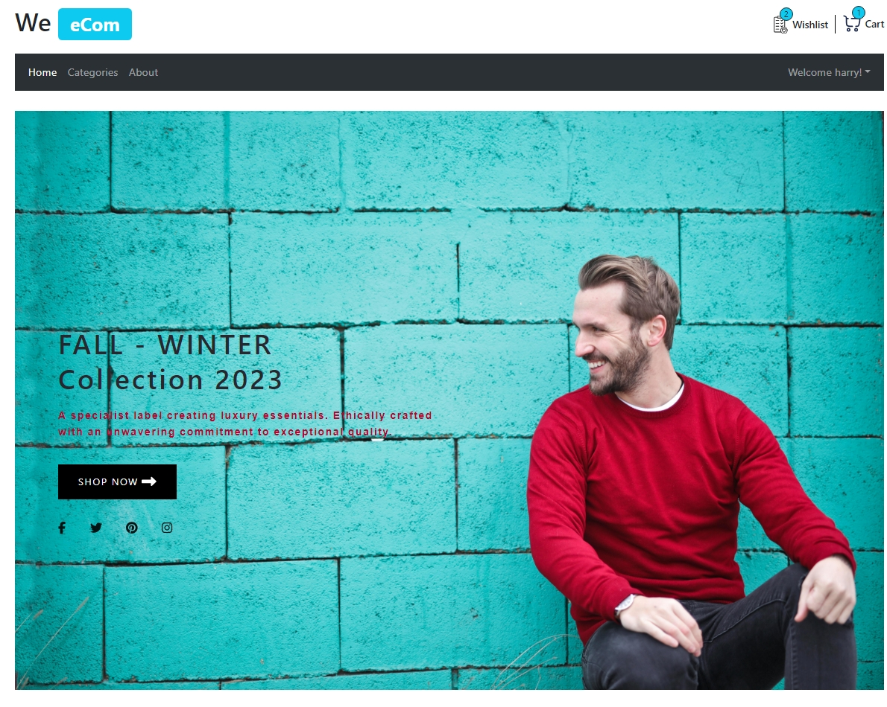
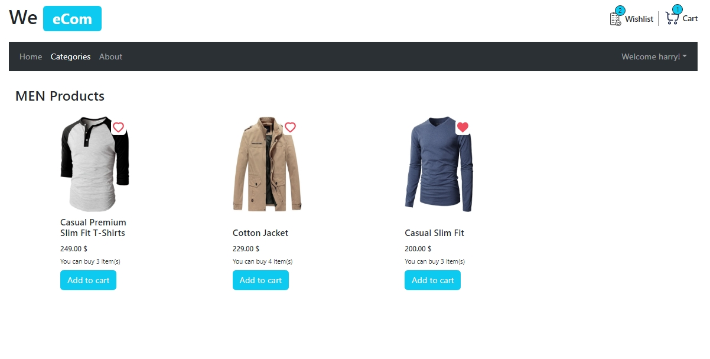
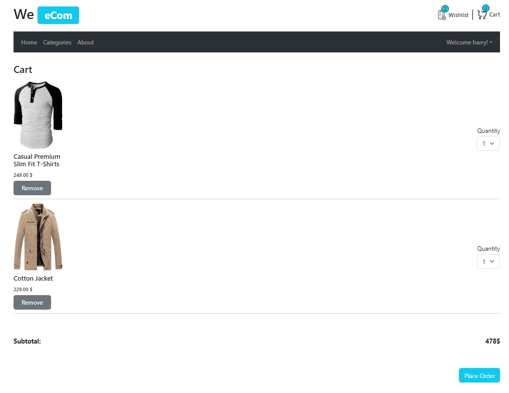

# ECommerce App with React & TypeScript (in progress)

This project is a e-commerce application built with React and TypeScript. It includes features such as product listing, product details, cart management, wishlist management, placing orders and user authentication.

  
  
  
  

I have included many modern js packeges in this project:

- **Axios**
- **React-BootStrap**
- **Lottie-React** for animations
- **React-hook-form** and **Zod** for validating form
- **Redux ToolKit** for managing the app state
- **React Router** for managing navigation
- **Swiper** for making carousels
- **Json-server** for making a fake API

You watch a live version of this project by clicking [here](https://m-mohammad25.github.io/ECommerce-App-with-React-TypeScript/)

You Can use the following credentials to login:
email: h.potter@hogwarts.edu
password: 12345@

> **Note:** The live version uses **sample data** for demonstration purposes. Any changes made **will not** be preserved.
