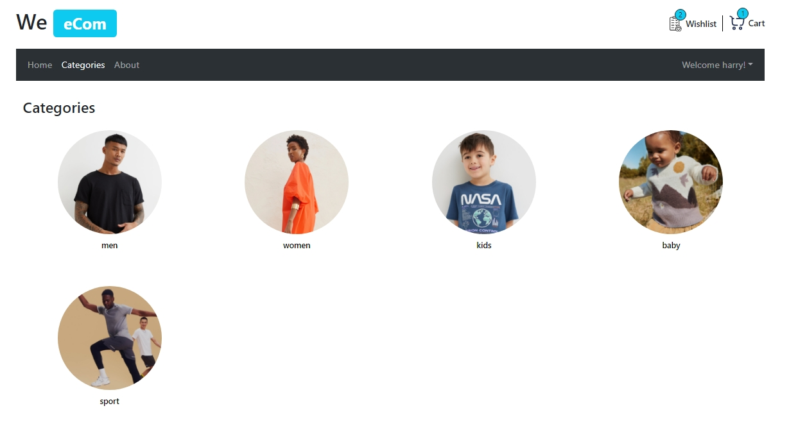

# ECommerce App with React & TypeScript (in progress)

This project is a e-commerce application built with React and TypeScript. It includes features such as product listing, product details, cart management, wishlist management, placing orders and user authentication.

I have included many modern js packeges in this project:

- **Axios**
- **React-BootStrap**
- **Lottie-React** for animations
- **React-hook-form** and **Zod** for validating form
- **Redux ToolKit** for managing the app state
- **React Router** for managing navigation
